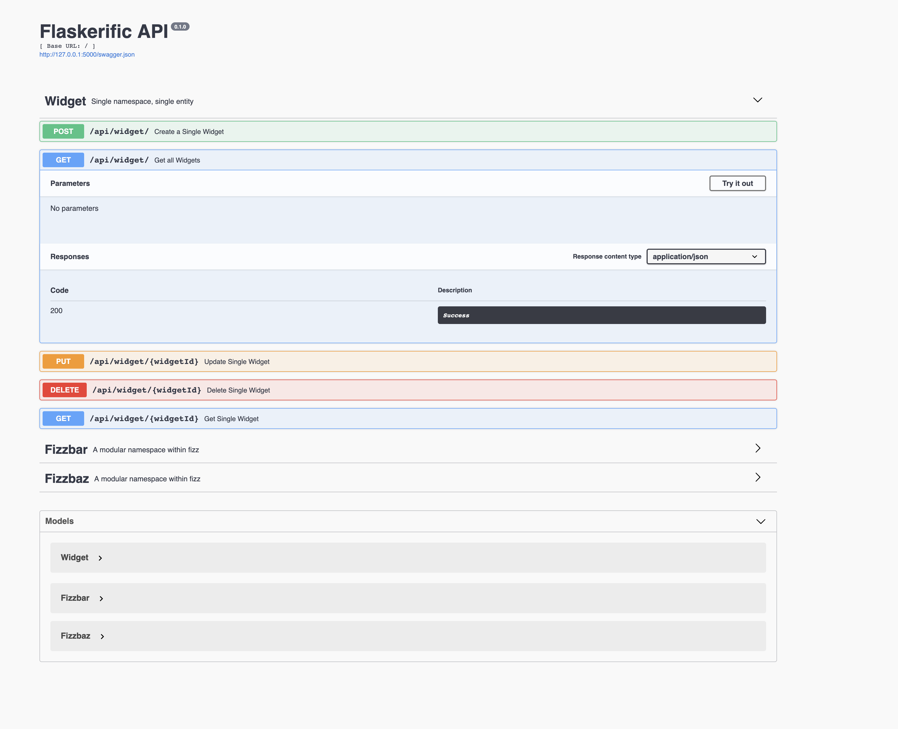

# A Sample app that takes in a json object model and genearte necessary code for ORM 



The project was forked from https://github.com/apryor6/flask_api_example 

Using json to describle datamodal, and automatically geneate sqlalchemy code . 

ie : if we have a user modal :
{
    "classname":"User",
    "columns":[
        {
            "name": "id"
            , "type": "Integer()"
            , "descr" :  ", primary_key=True"
        },
        {
            "name": "email"
            ,"type": "String(255)"
        },
        {
            "name": "firstname"
            ,"type": "String(255)"
        },
        {
            "name": "lastname"
            ,"type": "String(255)"
        },
        {
            "name": "phone"
            ,"type": "String(16)"
        },
        {
            "name":"company_id"
            ,"type": "Integer()"
            ,"descr": ", ForeignKey('company.id')"
        }
    ]
}

## Buiding the app
docker build -f  Dockerfile.dev -t grwang/flask_orm  ./

## Running the app


Preferably, first create a virtualenv and activate it, perhaps with the following command:

```
virtualenv -p python3 venv
source venv/bin/activate
```

Next, run

```
pip install -r requirements.txt
```

to get the dependencies.

Next, initialize the database

```
python manage.py seed_db
```

Type "Y" to accept the message (which is just there to prevent you accidentally deleting things -- it's just a local SQLite database)

Finally run the app with

```
python wsgi.py
```

Navigate to the posted URL in your terminal to be greeted with Swagger, where you can test out the API.


## Running tests

To run the test suite, simply pip install it and run from the root directory like so

```
pip install pytest
pytest
```

